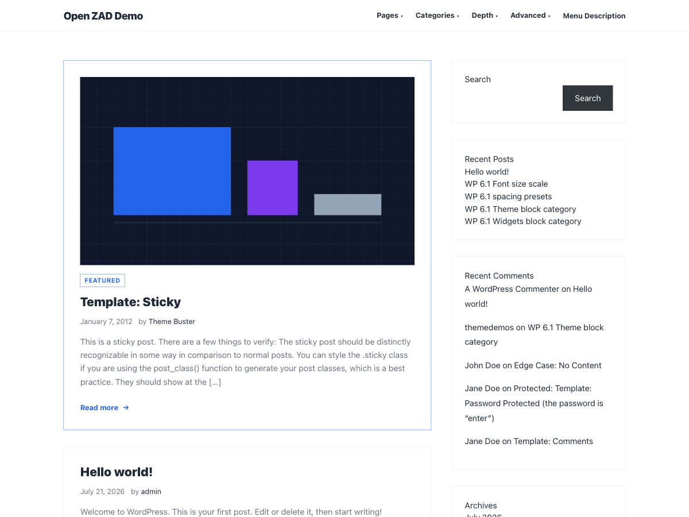
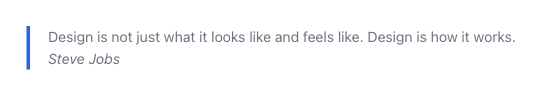
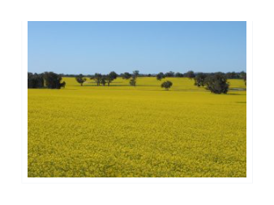
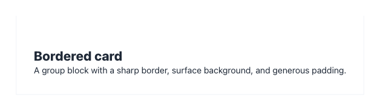
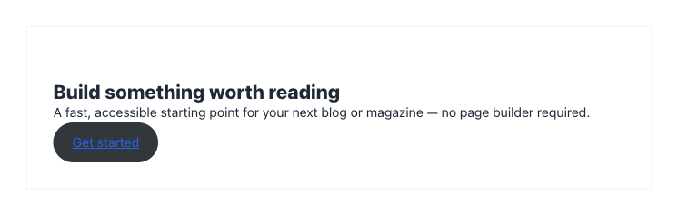
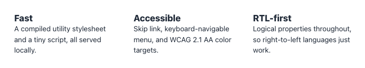

# Open ZAD

A fast, accessible, **RTL-first** WordPress theme with a clean, utilitarian
design system configured entirely from the Customizer — no page builder, no
admin console, no external requests.




Built to the
[WordPress.org Theme Directory](https://make.wordpress.org/themes/handbook/review/required/)
requirements. This repository **is** the theme — the repo root is the theme
source; `bin/build-zip.sh` stages it under the distribution slug `open-zad`.

> **Status:** submitted to the WordPress.org theme directory and passing the
> automated scan — under manual review
> ([ticket #282821](https://themes.trac.wordpress.org/ticket/282821)).

## Features

- **RTL-first** — logical CSS properties throughout, so right-to-left
  languages work without a separate stylesheet.
- **Accessible** — skip link as the first focusable element, keyboard-navigable
  menu with visible focus, and WCAG 2.1 AA color targets.
- **Customizer-driven** — primary / accent / text colors with live preview,
  custom logo, custom background, and an optional header image.
- **Self-contained** — one compiled stylesheet and a tiny vanilla-JS
  navigation script, all served locally. No CDN, no framework, no build step
  required to run.
- **Content-ready** — featured images, threaded comments, post/comment
  pagination, a right sidebar on blog/archive views, and footer widgets.
- **Block-aware** — wide/full alignment, responsive embeds, editor styles, plus
  three custom block styles and two block patterns (see below).
- **Translation-ready** — every string wrapped for i18n; `languages/open-zad.pot`
  included.

## Requirements

- WordPress **6.5+**
- PHP **8.0+**

## Installation

1. In your admin, go to **Appearance → Themes → Add New**.
2. Click **Upload Theme** and choose `open-zad.zip` (built with
   `bin/build-zip.sh`), or copy the theme folder into `wp-content/themes/`.
3. Click **Activate**, then open **Appearance → Customize** to set your colors,
   logo, background, and menus.

## Customizer options

| Section | Control |
| --- | --- |
| **Theme Colors** | Primary, Accent, and Text colors (live preview) |
| **Site Identity** | Custom logo, site title/tagline, optional footer credit |
| **Header Image** | Optional banner image below the site header |
| **Background** | Solid background color or image |
| **Menus** | Primary menu and Footer menu locations |
| **Widgets** | Sidebar (blog/archive) and Footer widget areas |

## Block styles & patterns

Registered in [`inc/block-styles.php`](inc/block-styles.php) and
[`inc/block-patterns.php`](inc/block-patterns.php):

- **Block styles** — *Bordered* quote, *Framed* image, and *Bordered card*
  group.
- **Block patterns** (under an "Open ZAD" category) — *Call to action card*
  and *Three-column features*, built from core blocks only.

### Style previews

**Bordered** quote — a sharp accent border on the inline-start edge:



**Framed** image — a bordered, padded frame on a surface background:



**Bordered card** group — a sharp border, surface background, and generous padding:



### Pattern previews

**Call to action card** — a heading, lead paragraph, and button inside the
*Bordered card* group style:



**Three-column features** — three equal columns, each with a heading and short
description:



## Local development

The stylesheet is compiled from Tailwind CSS. The compiled
`assets/css/main.css` is committed, so the theme runs with no build step —
rebuild only when you edit templates or `src/input.css`.

```bash
npm install          # installs tailwindcss (build-time only)
npm run build        # src/input.css -> assets/css/main.css (minified)
npm run watch        # rebuild on change while developing
```

> After editing templates or partials, always rebuild: the Tailwind build only
> emits utility classes it finds in the scanned `.php`/`.js` files.

## Repository layout

```
.                       repo root == theme source
├── *.php               template hierarchy (index, single, page, archive, ...)
├── inc/                customizer, template-tags, block-styles, block-patterns
├── template-parts/     content*.php partials
├── assets/
│   ├── css/main.css    compiled (committed)
│   └── js/             navigation.js, customizer.js (vanilla, no framework)
├── src/input.css       Tailwind source (compiles to assets/css/main.css)
├── tailwind.config.js  build config
├── languages/          open-zad.pot
├── readme.txt          WordPress.org readme (user-facing)
├── style.css           theme header (name, version, tags, license)
├── screenshot.png      1200×900 render of the theme
└── bin/                build + deploy helpers (not shipped in the theme)
```

## Building the submission zip

```bash
bin/build-zip.sh        # -> dist/open-zad.zip
```

The zip stages the theme under `open-zad/` (including the Tailwind source for
transparency) and excludes repo tooling: `bin/`, `dist/`, `.git`,
`.gitignore`, `.editorconfig`, `.claude/`, `node_modules/`, `README.md`, and
`package-lock.json`.

## Updating on WordPress.org

Updates are shipped as a zip re-upload: bump the version in `style.css` **and**
`readme.txt`, run `bin/build-zip.sh`, and upload the new zip at
<https://wordpress.org/themes/upload/> — it links to the existing review
ticket automatically. (WordPress.org themes are updated by zip upload, not by
committing to SVN directly.)

## License

GPL-2.0-or-later. See [LICENSE](LICENSE). The theme uses Tailwind CSS (MIT) at
build time only; it is not a runtime dependency. `screenshot.png` is a render
of this theme, and the featured-image graphic shown in it is self-authored —
both GPL-2.0-or-later.
